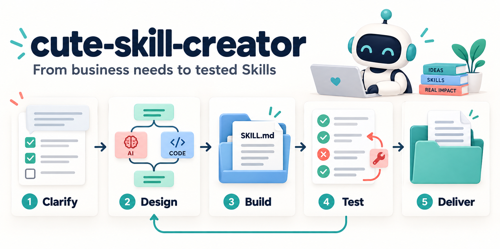

# cute-skill-creator

**从一句业务需求，走到可执行、可验证、可追溯的 Skill。**



`cute-skill-creator` 是一个创建业务技能的 Skill。你描述要解决的问题，它帮助你明确需求、设计流程、选择 AI 或代码执行方式，生成技能，并用实际测试结果完成交付。

适合把订单分析、对账、内容分类、资料整理等业务流程沉淀为可重复使用的技能，也适合修订已有技能并验证改动。

## 独特价值

### 1. 一份菜单说清需求，确认后连续执行

先复用已有信息，再将当前可预见的待决事项汇总为编号菜单。支持推荐项、自定义答案，以及 `1A，2B，3A` 这样的统一回复。收到明确选择后，直接继续设计、生成与测试。

仅在关键漏答、答案冲突或出现新的关键依赖时集中补问。工具无法容纳整批问题时，使用完整文本菜单。详见 [菜单式集中澄清](skills/cute-skill-creator/references/clarification.md)。

### 2. 每个步骤选择合适的执行方式

同一个技能可以组合三种执行方式，并记录选择依据：

| 执行方式 | 适合的工作 | 示例 |
| --- | --- | --- |
| AI | 语义理解、开放判断、解释和建议 | 解释订单变化，区分观察与待验证假设 |
| 代码 | 明确规则、精确计算、格式转换 | 用整数分汇总金额，关联退款，导出 CSV |
| 混合 | 模型产生候选，代码检查约束后继续 | 为洞察关联真实指标，校验证据引用再渲染报告 |

人工批准由实际授权和操作影响决定。已有授权范围内的本地步骤连续执行，混合执行本身不额外增加审批。

### 3. 需求成为可检查的项目记录

`project.json` 保存目标、输入输出、流程、规则、环境与验收条件。需求分别标记为已确认、待确认或暂定假设，并记录来源。

`check` 检查关键缺口、节点依赖、资源引用和测试覆盖。影响正确性或权限的关键未知项，会阻止依赖这些信息的生成步骤；非关键假设则保留在交付说明中。

### 4. 测试执行到业务结果

代码测试采用精确 JSON 断言；AI 与混合步骤使用真实模型响应、评分标准、至少两次重复和无技能或旧版对照。测试覆盖结构、正反触发、节点、端到端、异常与回归，并按需检查混合交接。

报告区分 **通过、失败、阻塞、未执行**。缺少模型适配器或运行条件时如实记录阻塞；只有当前交付的全部必测项实际通过，才标记业务验证通过。

### 5. 每次交付都能追溯到证据

交付按内容摘要保存版本，记录需求、流程、源文件和资源清单。每轮测试保留输入、预期、输出、执行日志、耗时、模型信息及可观测的 Token 用量。

报告会核对交付与证据是否发生变化，帮助避免将旧版测试结果用于新版技能。

### 6. 失败后修订，再验证

通过 `revise → build → test` 记录问题、修改和复测。支持单项测试定位问题，最终交付要求完整重测；历史版本与证据保留，便于回看修复过程。

## 三步开始

### 1. 安装创建器

需要 Python 3.9+，以及能够加载 Skill 并执行本地命令的 AI 宿主。创建器脚本与自身自动化测试仅依赖 Python 标准库；生成的业务技能可能需要额外依赖。

克隆本仓库：

```bash
git clone https://github.com/zhaozhencn/cute-skill-creator.git
cd cute-skill-creator
```

在仓库根目录进行首次安装：

```bash
mkdir -p "${CODEX_HOME:-$HOME/.codex}/skills"
cp -R skills/cute-skill-creator "${CODEX_HOME:-$HOME/.codex}/skills/"
```

其他兼容宿主可将整个 `skills/cute-skill-creator/` 目录复制到自己的技能目录，保留 `scripts/` 和 `references/`。

### 2. 描述业务目标

在能够发现该技能的会话中输入：

```text
$cute-skill-creator
创建一个自动订单分析与洞察报告技能。
输入 Excel/CSV，按月统计销售与退款，按店铺和商品分析，
输出中文 HTML 报告与 CSV，并完整测试。
```

对集中菜单统一回复，例如：

```text
1A，2B，3A，4A，5A，6A
```

实际问题和选项根据业务缺口生成；信息充分时直接执行。

### 3. 接收技能与验收结果

交付包含：

- **业务需求说明**：目标、范围、规则、信息来源与假设。
- **流程设计**：节点、执行方式、依赖、分支与失败处理。
- **可执行 Skill**：`SKILL.md` 和实际需要的脚本、参考资料。
- **测试报告与证据**：哪些通过、哪些未通过，以及对应记录。

AI 推理由宿主承担，测试模型通过适配器接入。创建器不内置凭证，也不绑定某个模型供应商。

## 实测案例：销售订单统计与洞察

一次完整试用中，用户统一确认了六项选择：商品明细与退款事件输入、退款按发生月统计、HTML＋CSV 输出、经营洞察、文件提供后自动执行、异常时停止正式统计。

创建器生成了 `order-analysis-insights`，将精确计算、模型洞察和证据校验分别实现，并在实际试用中修复了长周期退款摘要超限、币种限制未落实、窄屏溢出和损坏 Excel 错误处理问题。

| 验证项 | 该次运行结果 |
| --- | --- |
| 确定性测试 | 31 项通过，覆盖金额精度、退款归属、去重、输入异常及导出 |
| 真实模型测试 | 4 项通过；候选与无技能对照各执行两次 |
| 最终完整测试 | **35 通过 · 0 失败 · 0 阻塞 · 0 未执行** |
| 独立完整试用 | 从 XLSX 到模型洞察与 HTML/CSV，执行期间无额外确认 |
| 浏览器检查 | 桌面与 390px 窄屏，检查布局、证据展开和报告链接 |

查看 [案例说明](docs/order-analysis-case-study.md) 和 [逐项验证快照](docs/examples/order-analysis-validation.json)。这些结果来自合成数据和一次具体版本的验证；不代表真实订单已经验证，也不证明相较无技能对照具有统计显著优势。模型测试使用同一配置模型的独立生成与评审会话。

## 本地可复现示例

[订单金额汇总示例](examples/order-summary/project.json) 提供完整项目契约与业务代码，可以先体验构建、测试和报告流程：

```bash
DEMO_ROOT="$(mktemp -d)"
cp -R examples/order-summary "$DEMO_ROOT/order-summary"

python3 skills/cute-skill-creator/scripts/creator.py build \
  --workspace "$DEMO_ROOT/order-summary"
python3 skills/cute-skill-creator/scripts/creator.py test \
  --workspace "$DEMO_ROOT/order-summary"
```

这个小示例包含 **6 项可直接运行的确定性测试**，以及 **2 项尚未配置模型适配器的触发测试**。预期结果为 `6 passed / 2 blocked`，`test` 返回码为 `1`。接入真实模型及对照适配器后，才能完成它的全部业务验证。

## 命令行与项目结构

宿主负责业务理解、内容和代码编写；CLI 负责校验、组装、执行及报告。初始化工作目录后，按 [项目契约](skills/cute-skill-creator/references/project-contract.md) 完善内容。

```bash
python3 skills/cute-skill-creator/scripts/creator.py init \
  --workspace /path/to/workspace --name my-business-skill
```

其余命令均使用 `python3 skills/cute-skill-creator/scripts/creator.py <命令> --workspace <工作目录>`：

| 命令 | 作用 |
| --- | --- |
| `check` | 列出需求缺口与流程、测试契约错误 |
| `build` | 生成带内容摘要的技能版本、需求说明与流程设计 |
| `test` | 实际执行测试与对照，保存证据；`--case ID` 可定向诊断 |
| `revise --issue '问题' --change '修改'` | 记录修订，关联前次运行 |
| `report` | 核对当前交付与证据，重建最近一次报告 |

```text
skills/cute-skill-creator/    创建器 Skill、执行器及参考协议
examples/order-summary/     可运行的最小业务示例
tests/                      创建器单元与回归测试
docs/                       实现说明、验证记录与案例
```

业务工作目录中的交付位于 `delivery/<内容摘要>/<skill-name>/`，测试证据位于 `runs/<run-id>/`。测试文件和运行日志不复制到生成的 Skill 内。

## 开发与验证

```bash
make test      # 创建器单元与回归测试
make verify    # 上述测试 + 静态检查 + CLI 端到端验证，并保存证据
```

验证产物写入 `artifacts/verification/`。单元测试中的 AI 协议替身只验证软件逻辑；真实模型行为另见 [验证记录](docs/validation.md)。

- [设计方案](skill-creator-design.md)
- [实现说明](docs/implementation.md)
- [测试与证据协议](skills/cute-skill-creator/references/testing.md)
- [AI／代码／混合执行方式](skills/cute-skill-creator/references/execution-guide.md)

## 使用边界

测试命令以当前进程权限运行，创建器本身不是沙箱。执行命令前需核对来源和既有授权。SHA-256 用于检查内容一致性和识别旧证据，不提供数字签名认证。模型评分依赖实际执行及评审质量；适配器和运行条件缺失时，相关测试保持阻塞。
